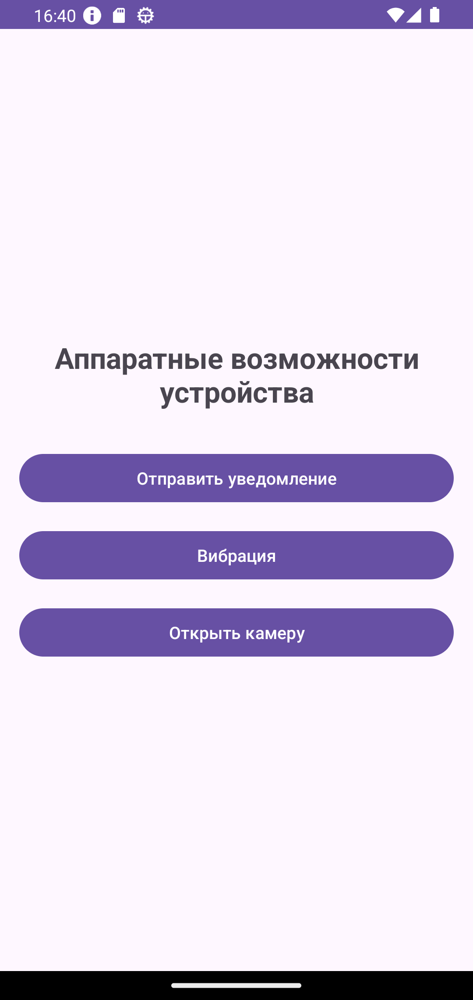
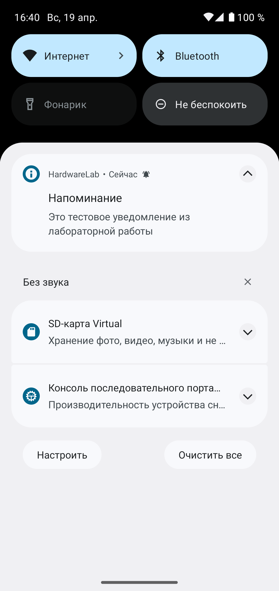

<div align="center">

# Отчет

</div>

<div align="center">

## Практическая работа №10

</div>

<div align="center">

## Использование аппаратных возможностей устройства. Разрешения, уведомления, вибрация, камера

</div>

**Выполнил:**
Майстренко Константин Александрович
**Группа:** инс-б-о-24-2

---

### Цель работы

Изучить механизм работы с разрешениями в Android, научиться создавать уведомления, управлять вибрацией устройства, а также получать доступ к камере для предварительного просмотра изображения.

### Ход работы

В ходе выполнения практической работы было создано Android-приложение, использующее аппаратные возможности устройства и системные механизмы Android.

Сначала был подготовлен файл `AndroidManifest.xml`, в который были добавлены необходимые разрешения для работы приложения. В зависимости от реализованной функциональности использовались разрешения на доступ к камере, вибрации и другим возможностям устройства.

После этого была реализована логика проверки и запроса опасных разрешений во время выполнения приложения. Перед использованием камеры приложение проверяло, выдано ли соответствующее разрешение, и при необходимости запрашивало его у пользователя. Также была добавлена обработка результата запроса разрешения.

Далее был реализован механизм создания уведомлений. Для поддержки Android 8.0 и выше был создан канал уведомлений (`NotificationChannel`), после чего по нажатию на кнопку приложение отправляло уведомление с заданным заголовком и текстом.

Затем была реализована работа с вибрацией устройства. При выборе соответствующего действия приложение запускало вибрацию по заданному шаблону с использованием класса `Vibrator` и `VibrationEffect`.

Также в приложении была реализована работа с камерой. Для этого была создана отдельная активность с `SurfaceView`, в которой осуществлялся предварительный просмотр изображения с камеры. Перед открытием камеры приложение проверяло наличие разрешения `CAMERA`, а при отсутствии запрашивало его у пользователя.

Таким образом, в приложении были объединены основные механизмы взаимодействия с аппаратными возможностями устройства: разрешения, уведомления, вибрация и камера.

Ниже приведены скриншоты выполнения работы.

<div align="center">


*Рисунок 1. Главный экран приложения и работа с разрешениями*

</div>

<div align="center">


*Рисунок 2. Создание уведомления и работа вибрации*

</div>

<div align="center">


*Рисунок 3. Предварительный просмотр изображения с камеры*

</div>

### Вывод

В результате выполнения практической работы были изучены основные способы взаимодействия Android-приложения с аппаратными возможностями устройства.
Я научился объявлять и запрашивать разрешения, создавать уведомления, использовать вибрацию устройства и получать доступ к камере для предварительного просмотра изображения.
Практическая работа позволила лучше понять, как в Android организована безопасная работа с системными ресурсами и аппаратными компонентами устройства.

### Ответы на контрольные вопросы

1. **В чём разница между нормальными и опасными разрешениями? Приведите примеры.**
   Нормальные разрешения предоставляются приложению автоматически при установке, так как они не затрагивают конфиденциальные данные пользователя.
   Опасные разрешения дают доступ к чувствительным данным или аппаратным возможностям устройства и требуют отдельного запроса во время выполнения приложения.
   Примеры:

   * нормальные: `INTERNET`, `ACCESS_NETWORK_STATE`;
   * опасные: `CAMERA`, `RECORD_AUDIO`, `ACCESS_FINE_LOCATION`, `READ_CONTACTS`.

2. **Как запросить опасное разрешение во время выполнения приложения? Опишите последовательность действий.**
   Сначала нужно проверить наличие разрешения через `checkSelfPermission()`.
   Если разрешение не выдано, его нужно запросить через `requestPermissions()`.
   После этого результат запроса обрабатывается в методе `onRequestPermissionsResult()`.
   При необходимости перед запросом можно показать пользователю пояснение через `shouldShowRequestPermissionRationale()`.

3. **Для чего нужен NotificationChannel в Android 8.0 и выше?**
   Начиная с Android 8.0, все уведомления должны принадлежать определённому каналу.
   `NotificationChannel` нужен для группировки уведомлений и настройки их поведения: важности, звука, вибрации и других параметров.
   Без созданного канала уведомление на Android 8.0+ не будет отображаться.

4. **Как создать простое уведомление и отобразить его?**
   Для этого создаётся объект `NotificationCompat.Builder`, в котором задаются иконка, заголовок, текст и приоритет. После этого уведомление отправляется через `NotificationManagerCompat`.
   Пример:

   ```java
   NotificationCompat.Builder builder = new NotificationCompat.Builder(this, "CHANNEL_ID")
           .setSmallIcon(android.R.drawable.ic_dialog_info)
           .setContentTitle("Напоминание")
           .setContentText("Пришло время выполнить задачу")
           .setPriority(NotificationCompat.PRIORITY_DEFAULT);

   NotificationManagerCompat.from(this).notify(1, builder.build());
   ```

5. **Какие методы класса Vibrator используются для создания вибрации? Как создать вибрацию с заданным паттерном?**
   Для простой вибрации можно использовать метод `vibrate(long milliseconds)`.
   Для вибрации по шаблону используется `VibrationEffect.createWaveform()` на новых версиях Android или `vibrate(long[] pattern, int repeat)` на старых.
   Пример паттерна:

   ```java
   vibrator.vibrate(VibrationEffect.createWaveform(new long[]{0, 500, 1000, 500}, -1));
   ```

6. **Как получить доступ к камере для предварительного просмотра? Какие классы для этого используются?**
   Для упрощённого предварительного просмотра можно использовать `SurfaceView`, `SurfaceHolder` и класс `Camera` или современный API `Camera2`.
   Сначала создаётся `SurfaceView`, затем через `SurfaceHolder.Callback` отслеживаются события создания и изменения поверхности. После этого камера открывается, и превью передаётся в `SurfaceHolder`.

7. **Что произойдёт, если попытаться использовать опасное разрешение без его запроса во время выполнения на Android 6.0+?**
   Если приложение попытается использовать опасное разрешение без запроса во время выполнения, доступ к соответствующей функции будет запрещён.
   В зависимости от ситуации это может привести к ошибке выполнения, исключению или просто к неработающему функционалу.

8. **Как проверить, есть ли у приложения определённое разрешение в данный момент?**
   Для этого используется метод:

   ```java
   ContextCompat.checkSelfPermission(this, Manifest.permission.CAMERA)
   ```

   Если результат равен `PackageManager.PERMISSION_GRANTED`, значит разрешение уже выдано.

### Список литературы

1. Phillips, B., Stewart, K., & Marsicano, K. *Android Programming: The Big Nerd Ranch Guide* (5th Edition). Big Nerd Ranch Guides, 2022.
2. Документация Android Developers. Руководство по разрешениям в Android.
3. Документация Android Developers. Руководство по уведомлениям.
4. Гриффитс Д., Гриффитс Д. *Head First. Программирование для Android*. Питер, 2021.
5. Соколова В. В. *Разработка мобильных приложений на платформе Android*. М.: Юрайт, 2021.
